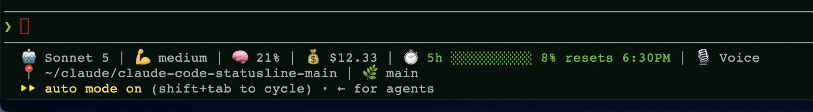

# Claude Code Statusline

A custom statusline script for [Claude Code](https://claude.ai/claude-code) that displays real-time session information in your terminal.



## What It Shows

```
🤖 Sonnet 5 | 💪 medium | 🧠 21% | 💰 $12.33 | ⏱️ 5h ████████░░ 8% resets 6:30PM | 🎙️ Voice
📍 ~/claude/claude-code-statusline-main | 🌿 main
```

| Field | Description |
|---|---|
| 🤖 Model | Active Claude model name |
| 🧠 Context | Context window usage percentage with color thresholds |
| 💰 Cost | Cumulative session cost in USD |
| ⏱️ Rate Limit | 5-hour rate limit usage bar, percentage, and reset time |
| 🎙️ Voice | Shown only when voice mode is currently enabled (read from `~/.claude/settings.json`) |
| 📍 Path | Actual current working directory, with `$HOME` abbreviated to `~` |
| 🌳 Worktree | Shown only when relevant: the `--worktree` session name, or a linked `git worktree add` checkout name. Omitted entirely otherwise, to keep the line short |
| 🌿 Branch | Current git branch with lines added/removed |

## Prerequisites

- [Claude Code](https://claude.ai/claude-code) CLI installed
- **Python 3.9+** — Pre-installed on macOS 12.3+ and modern Linux distributions
- `git` — for branch and diff stats (optional; gracefully falls back if not available)

### Python Installation (if needed)

Python 3 is usually pre-installed. If not:

```sh
# macOS
# If not available, install via python.org (no Homebrew needed):
# https://www.python.org/downloads/macos/

# Ubuntu/Debian
sudo apt-get install python3

# Windows
# Use WSL or download from https://www.python.org/downloads/windows/
```

## Setup

**1. Copy the script somewhere accessible:**

```sh
cp statusline-command.py ~/.claude/statusline-command.py
chmod +x ~/.claude/statusline-command.py
```

**2. Add the statusline configuration to `.claude/settings.json`:**

For a **global** setup (applies to all projects), edit `~/.claude/settings.json`:

```json
{
  "statusLine": {
    "type": "command",
    "command": "python3 ~/.claude/statusline-command.py",
    "padding": 0
  }
}
```

For a **project-level** setup, add the same block to `.claude/settings.json` in your project root.

**3. Start Claude Code** — the statusline will appear automatically.

### Keeping it fresh during idle periods

Claude Code re-runs your statusline script on specific events: a new assistant message, `/compact` finishing, a permission-mode change, or a vim-mode toggle. Anything else that changes state out-of-band — like toggling voice mode with `/voice` — won't be reflected until one of those triggers fires next.

If you want segments like 🎙️ Voice to update promptly even while idle, add `refreshInterval` (seconds) to the `statusLine` block:

```json
{
  "statusLine": {
    "type": "command",
    "command": "python3 ~/.claude/statusline-command.py",
    "padding": 0,
    "refreshInterval": 2
  }
}
```

This polls the script on a timer in addition to the event-driven triggers. See [Performance](#performance) below for the cost of doing this.

**Note:** On macOS and Linux, the shebang allows you to run directly:
```sh
~/.claude/statusline-command.py < input.json
```

On Windows (native CMD/PowerShell), use explicit invocation:
```powershell
python3 ~/.claude/statusline-command.py < input.json
```

## Customization

The script reads a JSON object from stdin with the following fields:

| Field | Description |
|---|---|
| `model.display_name` | Name of the active model |
| `effort.level` | Effort level (optional; only displayed if present) |
| `context_window.used_percentage` | Context usage as a float (0-100) |
| `cost.total_cost_usd` | Cumulative session cost |
| `rate_limits.five_hour.used_percentage` | 5-hour rate limit usage percentage |
| `rate_limits.five_hour.resets_at` | Unix timestamp when 5-hour limit resets |
| `rate_limits.seven_day.used_percentage` | 7-day rate limit usage percentage (available for optional display) |
| `rate_limits.seven_day.resets_at` | Unix timestamp when 7-day limit resets (available for optional display) |
| `cwd`, `workspace.current_dir` | Current working directory (used for the 📍 path). Both hold the same value; `workspace.current_dir` is read first |
| `worktree.name` | Active worktree name, present only during `--worktree` sessions |
| `workspace.git_worktree` | Worktree name for a linked `git worktree add` checkout (fallback when `worktree.name` is absent) |

Voice mode state isn't part of the stdin payload — it's a persistent client setting, so the script reads it directly from `~/.claude/settings.json` (`voice.enabled` or the legacy `voiceEnabled` key) each time it runs.

### Context Usage Colors

The 🧠 context percentage displays with color thresholds based on usage:
- White: <30% usage
- 🟡 Yellow: 30-44% usage
- 🟠 Orange: 45-49% usage
- 🟣 Purple: 50-55% usage
- 🔴 Red: ≥55% usage

### Rate Limit Colors

The rate-limit bar uses color thresholds:
- 🟢 Green: <70% usage
- 🟡 Yellow: 70-89% usage  
- 🔴 Red: ≥90% usage

### Editing the Script

Edit `statusline-command.py` to:
- Change context usage color thresholds (`main()`, around line 184)
- Adjust rate-limit color codes (`format_rate_limit()`, around line 56)
- Modify bar width (`make_bar()`, line 37: `width = 10`)
- Change the output format (`line1`/`line2` at the end of `main()`)
- Add or remove fields from the display
- Add 7-day rate limit display alongside 5-hour (both are already parsed from `rate_limits.seven_day.*`; `format_rate_limit()` is reusable for it)

## Performance

Each run costs roughly:

| Cost | Approx. time |
|---|---|
| Python interpreter startup | ~30ms |
| One `git status --porcelain=v2 --branch` call (branch + staged/modified counts in a single subprocess) | ~25-60ms depending on repo size |
| JSON parsing and formatting | negligible |
| **Total** | **~80-100ms per run** |

Earlier versions spawned 4 separate `git` subprocesses (`rev-parse`, `branch`, `diff --cached`, `diff`); these are now combined into one `git status` call, cutting per-run time by roughly 40%.

With a 2-second `refreshInterval`, that's on the order of a 4-5% single-core duty cycle in short bursts — not sustained load, and comparable to what a git-aware shell prompt already does on every keystroke. If you want it lighter still, raise `refreshInterval` (e.g. to 5 or 10 seconds) at the cost of segments like 🎙️ Voice taking longer to catch up after an out-of-band change.

## Credits

This project started from [danielmackay/claude-code-statusline](https://github.com/danielmackay/claude-code-statusline) — a 3-file `sh`/`jq` statusline script (`README.md`, `screenshot.png`, `statusline-command.sh`) with the same two-line layout and 🤖/🧠/💰/⏱️/📁/🌳/🌿 field set. That upstream repo carries no LICENSE file, so no explicit terms are granted; this fork is shared in that same spirit, with full credit to the original author for the concept and initial design.

**What's changed since:**
- Rewritten from `sh` + `jq` to dependency-free Python 3 (no `jq` requirement)
- Fixed the directory/worktree fields against the real Claude Code statusline JSON schema (the assumed schema silently showed "unknown" and "no worktree" outside of `--worktree` sessions — see [git history](https://github.com/raghnallp-hub/claude-code-statusline/commits/main) for the debugging story)
- Added a 🎙️ Voice indicator, read from `~/.claude/settings.json` since voice mode isn't part of the stdin payload
- Dropped the redundant 📁 repo-name field in favor of a single 📍 path segment (with `$HOME` abbreviated to `~`), and made the 🌳 worktree segment appear only when actually relevant
- Consolidated `get_git_info()` from 4 git subprocess spawns down to 1 (`git status --porcelain=v2 --branch`), cutting per-run latency by roughly 40%
- Added a `refreshInterval`-aware "Performance" and "Keeping it fresh during idle periods" section, and a 52+/53-test security/robustness test suite (`test_statusline.py`)
